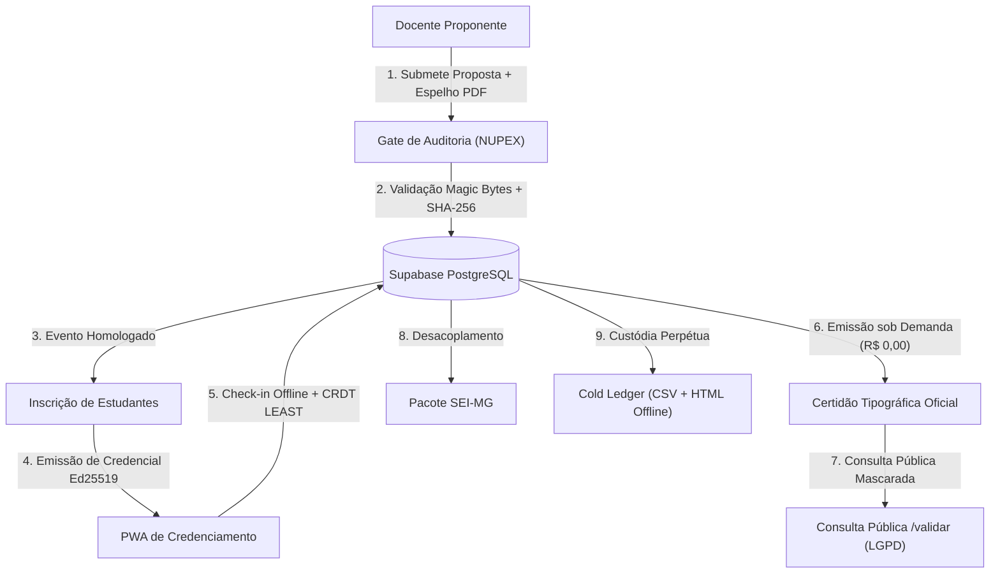

# 🏛️ Portal de Extensão Universitária — UEMG Unidade Carangola

[](https://nextjs.org/)
[](https://www.typescriptlang.org/)
[](https://supabase.com/)
[](https://tailwindcss.com/)
[](https://developer.mozilla.org/pt-BR/docs/Web/Progressive_web_apps)
[](https://www.uemg.br/)

Sistema institucional de gestão, credenciamento óptico em tempo real, auditoria formal de propostas e emissão sob demanda de certidões extensionistas com fé pública tipográfica para a **Universidade do Estado de Minas Gerais — Unidade Acadêmica de Carangola**.

---

## 📑 Sumário

- [Visão Geral e Contexto](#-visão-geral-e-contexto)
- [Conformidade Legal e Fé Pública](#-conformidade-legal-e-fé-pública)
- [Arquitetura e Inovações Tecnológicas](#-arquitetura-e-inovações-tecnológicas)
  - [1. Motor de Certificados sob Demanda (R$ 0,00 de Storage)](#1-motor-de-certificados-sob-demanda-r-000-de-storage)
  - [2. PWA Offline-First de Credenciamento (Ed25519 + CRDT)](#2-pwa-offline-first-de-credenciamento-ed25519--crdt)
  - [3. Gate de Auditoria Institucional (The Hard Box)](#3-gate-de-auditoria-institucional-the-hard-box)
  - [4. Desacoplamento e Integração SEI-MG](#4-desacoplamento-e-integração-sei-mg)
  - [5. Soberania Digital e Cold Ledger Perpétuo](#5-soberania-digital-e-cold-ledger-perpétuo)
- [Controle de Acesso Baseado em Papéis (RBAC Zero Trust)](#-controle-de-acesso-baseado-em-papéis-rbac-zero-trust)
- [Estrutura do Projeto](#-estrutura-do-projeto)
- [Guia de Instalação e Execução Local](#-guia-de-instalação-e-execução-local)
- [Scripts de Verificação e Testes Automatizados](#-scripts-de-verificação-e-testes-automatizados)
- [Manuais e Documentação de Contingência](#-manuais-e-documentação-de-contingência)
- [Créditos e Expediente Institucional](#-créditos-e-expediente-institucional)

---

## 🎯 Visão Geral e Contexto

O **Portal de Extensão da UEMG Carangola** foi projetado para substituir fluxos manuais de confecção e distribuição de certificados acadêmicos, garantindo **segurança jurídica irrefutável**, **custo operacional nulo em infraestrutura de nuvem** e **alta disponibilidade** em auditorias e credenciamento presencial em auditórios.

Desenvolvido para atender diretamente às diretrizes do **NUPEX (Núcleo de Pesquisa e Extensão)**, o sistema integra o ciclo de vida completo de uma ação extensionista:
1. **Submissão Docente:** Cadastro de propostas com anexo obrigatório do Espelho Oficial (SIGA/SUAP) e termo de responsabilidade (Art. 299).
2. **Gate de Auditoria:** Homologação rigorosa com validação de Magic Bytes e cálculo de SHA-256 do documento.
3. **Credenciamento PWA:** Leitura de QR Codes criptografados com funcionamento offline garantido para portarias e auditórios.
4. **Certificação sob Demanda:** Geração em tempo real do documento tipográfico oficial com chancelas das autoridades vigentes no momento do evento.
5. **Consulta Pública LGPD:** Validação de autenticidade instantânea com mascaramento estrito de dados sensíveis.
6. **Autuação SEI-MG & Cold Ledger:** Exportação simplificada para processos estaduais e livro-razão offline perpétuo.

---

## ⚖️ Conformidade Legal e Fé Pública

Todo o ecossistema do portal foi modelado em estrita observância à legislação federal e estadual:

| Norma Regulamentadora | Aplicação no Sistema |
| :--- | :--- |
| **Decreto Estadual nº 47.222/2017** | Regulamenta o uso de comunicações eletrônicas e a autenticidade de documentos públicos no Estado de Minas Gerais. Todas as certidões trazem carimbo tipográfico oficial, endereço permanente de verificação e código validador único. |
| **Lei Federal nº 14.063/2020** | Disciplina o uso de **Assinaturas Eletrônicas Avançadas** na administração pública. O sistema vincula as credenciais a signatários institucionais com MASP ativo, mantendo snapshot temporal imutável de mandatos. |
| **Lei nº 13.709/2018 (LGPD)** | Mascaramento compulsório de CPF (`***.456.789-**`) e e-mail (`u***o@uemg.br`) em todas as telas de consulta pública e validadores estáticos, preservando a privacidade dos titulares. |
| **Art. 299 do Código Penal Brasileiro** | Declaração expressa e gravada de responsabilidade administrativa contra falsidade ideológica no momento do envio de propostas e espelhos documentais. |

---

## 🔬 Arquitetura e Inovações Tecnológicas



### 1. Motor de Certificados sob Demanda (R$ 0,00 de Storage)
- **Eliminação de Armazenamento Estático:** Nenhum arquivo PDF de certificado pré-renderizado fica armazenado no disco do servidor ou em buckets de nuvem.
- **Renderização Dinâmica em Memória:** Ao ser solicitada pelo aluno ou validador, a certidão é calculada e renderizada dinamicamente em conformidade tipográfica oficial com estilos print-ready (CSS `@media print`), garantindo impressão em folha A4 com borda de segurança institucional.
- **Snapshot Temporal de Mandatos:** O documento congela os titulares vigentes na época do evento (Diretor da Unidade e Coordenador de Extensão, com nomes, MASP e atos de designação).

### 2. PWA Offline-First de Credenciamento (Ed25519 + CRDT)
- **Criptografia Assimétrica:** As credenciais dos participantes são assinadas digitalmente com curvas elípticas **Ed25519** via `tweetnacl`. O aplicativo scanner valida a autenticidade da assinatura localmente antes mesmo de tentar qualquer conexão de rede.
- **Fila Local no IndexedDB:** Monitores operam a leitura óptica dos QR Codes com feedback sonoro e tátil, mesmo em auditórios com sinal de internet inexistente. As leituras são enfileiradas com carimbo de tempo UTC.
- **Resolução de Conflitos CRDT Monotônica (`LEAST`):** Múltiplos monitores operando em portarias simultâneas podem registrar o mesmo aluno. Ao restaurar a conexão, o algoritmo monotônico seleciona com precisão matemática a **primeira leitura cronológica realizada**, registrando as demais na trilha de auditoria sem corrupção de dados.

### 3. Gate de Auditoria Institucional (The Hard Box)
- **Validação de Magic Bytes:** Arquivos submetidos como espelho de aprovação sofrem checagem dos 5 primeiros bytes no servidor (`%PDF-`), impedindo executáveis renomeados.
- **Checksum de Fé Pública:** O hash SHA-256 do arquivo original é calculado e armazenado, garantindo auditabilidade contra alterações futuras.
- **Trilha de Auditoria Imutável:** Todas as decisões de aprovação ou recusa pelo NUPEX gravam a justificativa técnica, o MASP do auditor e o endereço IP da ação.

### 4. Desacoplamento e Integração SEI-MG
- **Pacote de Protocolo Oficial:** O Coordenador de Extensão compila em um único clique a lista de concluintes e copia a minuta de despacho padrão para autuação direta no SEI-MG.
- **Rastreabilidade Bidirecional:** Armazena o número do Processo SEI (`sei_process_number`) e do documento assinado (`sei_document_id`) para consulta institucional cruzada.

### 5. Soberania Digital e Cold Ledger Perpétuo
- **Validador Estático Independente (`validador_offline.html`):** Arquivo HTML autocontido exportado pela Coordenação que contém todos os registros de certidões do campus embutidos e um motor de busca JavaScript local. Funciona em qualquer computador ou pendrive **sem necessidade de internet, servidor ou banco de dados ativo**.
- **Backup Soberano SHA-256 (`/api/system/backup`):** Rota segura protegida por chave temporal constante (`timingSafeEqual`) que serializa todo o acervo institucional em JSON e gera o hash criptográfico oficial da custódia.

---

## 👥 Controle de Acesso Baseado em Papéis (RBAC Zero Trust)

O sistema implementa o princípio do Menor Privilégio (*Least Privilege*) validando a identidade diretamente contra a tabela `profiles` em cada chamada de página ou Server Action:

| Papel Institucional | Permissões no Sistema |
| :--- | :--- |
| **`participante`** | Inscrição em ações extensionistas, emissão e download de sua credencial e certidão de presença. |
| **`monitor`** | Acesso ao PWA de Credenciamento (`/monitor/checkin`) e sincronização de presenças offline. |
| **`docente`** | Proposição de novas ações (`/docente/nova-acao`), acompanhamento de homologação e emissão do Pacote SEI das suas propostas. |
| **`admin_extensao`** | Auditoria e homologação de propostas (`/auditoria`), gestão de mandatos de autoridades (`/admin/mandatos`), revogação de certidões, exportação de Cold Ledger e geração de backups soberanos (`/admin/dados`). |

---

## 📂 Estrutura do Projeto

```text
extensao-carangola/
├── .github/                       # Configurações de automação e CI
├── docs/
│   ├── contingencia/              # Protocolo físico de segurança (Cofre)
│   ├── devops/                    # Instruções de automação Keepalive
│   └── manuais/                   # Manuais de uso (Coordenador, Docente, Monitor, Estudante)
├── public/
│   ├── assets/logos/              # Logos oficiais UEMG e Portal
│   ├── manifest.json              # Manifesto PWA
│   └── sw.js                      # Service Worker para cache e modo offline
├── scripts/
│   ├── test_certificate_immutability.ts  # Teste automatizado da trigger de imutabilidade
│   └── test_crdt_concurrency.ts          # Teste de concorrência e monotonicidade CRDT
├── src/
│   ├── app/
│   │   ├── (dashboard)/           # Rotas autenticadas sob Route Group
│   │   │   ├── admin/dados/       # Custódia, Cold Ledger e Backups
│   │   │   ├── admin/mandatos/    # Gestão de autoridades signatárias
│   │   │   ├── auditoria/         # Gate de homologação do NUPEX
│   │   │   ├── docente/           # Painel de ações do docente proponente
│   │   │   └── monitor/checkin/   # PWA óptico de credenciamento
│   │   ├── actions/               # Server Actions com validação Zod e RBAC
│   │   ├── api/                   # Route Handlers (/api/system, /api/checkin)
│   │   ├── certificados/[regId]/  # Emissão e visualização de certidões
│   │   ├── eventos/[id]/          # Inscrição e credencial do aluno
│   │   ├── login/                 # Autenticação institucional com alerta de sessão
│   │   └── validar/[code]/        # Consulta pública de validação LGPD
│   ├── components/                # Componentes reutilizáveis (certificados, UI, SEI, PWA)
│   ├── hooks/                     # Custom hooks (rede, offline status)
│   ├── lib/
│   │   ├── auth/rbac.ts           # Guardiões SSR (requirePageAuth) e RBAC Server
│   │   ├── crypto/ed25519.ts      # Assinaturas TweetNaCl para credenciais
│   │   ├── offline/indexedDb.ts   # Armazenamento e sincronização local do PWA
│   │   ├── server-utils.ts        # Extração segura de IP e validação de PDFs
│   │   └── utils.ts               # Mascaramento LGPD, formatação e sanitização
│   └── types/                     # Tipagens do TypeScript e do Supabase
└── supabase/
    ├── migrations/                # DDL do PostgreSQL, RLS e Triggers de imutabilidade
    ├── promote_admin.sql          # Script de bootstrap do primeiro coordenador
    └── seed.sql                   # Carga de teste e ambiente inicial
```

---

## 🛠️ Guia de Instalação e Execução Local

### Pré-requisitos
- **Node.js** v18.18+ ou v20+
- Gerenciador de pacotes **npm** ou **yarn**
- Projeto ativo no **Supabase** (local via Docker ou Cloud)

### 1. Clonar o Repositório
```bash
git clone https://github.com/niltonfjunior2/extensao-carangola.git
cd extensao-carangola
```

### 2. Instalar Dependências
```bash
npm install
```

### 3. Configurar Variáveis de Ambiente
Crie um arquivo `.env.local` na raiz do projeto a partir do modelo institucional:
```bash
cp .env.example .env.local
```

Preencha as variáveis com as chaves do seu projeto Supabase:
```env
NEXT_PUBLIC_SUPABASE_URL=https://seu-projeto.supabase.co
NEXT_PUBLIC_SUPABASE_ANON_KEY=sua-anon-key
SUPABASE_SERVICE_ROLE_KEY=sua-service-role-key
SYSTEM_BACKUP_SECRET=chave-secreta-para-backups-automatizados
NEXT_PUBLIC_ED25519_PUBLIC_KEY=sua-chave-publica-ed25519-em-hex
ED25519_PRIVATE_KEY=sua-chave-privada-ed25519-em-hex
```

### 4. Executar Migrações do Banco de Dados
No painel **SQL Editor** do seu Supabase, execute as migrações na ordem:
1. `supabase/migrations/0000_initial_schema.sql` (Estrutura central e triggers)
2. `supabase/migrations/0001_multi_system_and_auth_rbac.sql` (Apoio multi-sistema SIGA/SUAP)
3. `supabase/migrations/0002_event_attachments_storage.sql` (Storage e bucket de espelhos)
4. `supabase/migrations/0002_sei_integration_and_backup.sql` (Tabelas SEI e Cold Ledger)
5. `supabase/seed.sql` (Opcional: dados iniciais para testes)

### 5. Iniciar o Servidor de Desenvolvimento
```bash
npm run dev
```
Acesse a aplicação no navegador em [http://localhost:3000](http://localhost:3000).

---

## 🧪 Scripts de Verificação e Testes Automatizados

O repositório inclui rotinas automatizadas para validação de tipagem, regras matemáticas de concorrência e blindagem de segurança:

```bash
# Verificação estrita de tipos TypeScript (tsc --noEmit)
npm run type-check

# Simulação de concorrência offline com múltiplos lotes (CRDT Monotônico)
npx tsx scripts/test_crdt_concurrency.ts

# Auditoria da trigger PostgreSQL de imutabilidade de certificados emitidos
npx tsx scripts/test_certificate_immutability.ts
```

---

## 📖 Manuais e Documentação de Contingência

O portal conta com documentação completa em linguagem acessível voltada a cada perfil da comunidade universitária:

- 📘 [Manual do Coordenador de Extensão (NUPEX)](docs/manuais/MANUAL_COORDENADOR.md)
- 📗 [Manual do Docente Proponente](docs/manuais/MANUAL_DOCENTE.md)
- 📙 [Manual do Monitor de Credenciamento](docs/manuais/MANUAL_MONITOR.md)
- 📕 [Manual do Estudante e Participante](docs/manuais/MANUAL_ESTUDANTE.md)
- 🔐 [Protocolo Físico do Cofre de Contingência](docs/contingencia/COFRE_DE_CONTINGENCIA.md)
- ⚙️ [Instruções de Keepalive e Automação DevOps](docs/devops/README.md)

---

## 🏛️ Créditos e Expediente Institucional

**Universidade do Estado de Minas Gerais (UEMG)**  
**Unidade Acadêmica de Carangola**  
Praça dos Estudantes, 23 — Santa Emília, Carangola - MG, CEP 36800-000  
*Núcleo de Pesquisa e Extensão (NUPEX)*  
*Coordenação de Tecnologia da Informação*

> *"A extensão universitária é o elo transformador entre a produção acadêmica e o desenvolvimento social, ético e sustentável da comunidade."*
